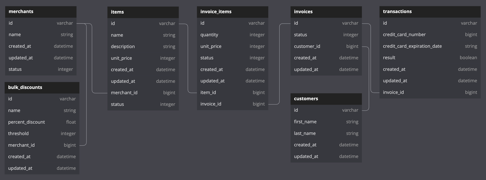

# Bulk Discounts

## Background and Description

"Bulk Discounts" is a project built upon a collaboration project called, "Little Esty[sic] Shop." It requires students to build a fictitious e-commerce platform where merchants and admins can manage inventory and fulfill customer invoices, then allow merchants to create discounts to apply to their invoices when one or more of the merchant's items have been purchased.

## Setup

This project requires Ruby 2.7.4. and Rails 5.2.x

* Fork this repository
* Clone your fork
* From the command line, install gems and set up your DB:
    * `bundle`
    * `rails db:create`
    * `rails csv_load:create`
* Run the test suite with `bundle exec rspec`.
* Run your development server with `rails s` to see the app in action.

## Heroku App

To experience the application's functionality, check out its Heroku app Page:
* [Bulk Discounts](https://bulk-discounts-zh.herokuapp.com/merchants/1/dashboard)

In its current iteration, the Heroku page does not contain a root path, so we begin searching through its resources from the above link, leading to the first merchant's dashboard.

## Phases

Students used a previous repository to build upon to implement the following functionality:
* [User Stories](https://backend.turing.edu/module2/projects/bulk_discounts)

The original repository, that may have been updated by its owner, can be found here:
* [Little Esty Shop](https://github.com/ruezheng/little-esty-shop)

## Database Diagram

